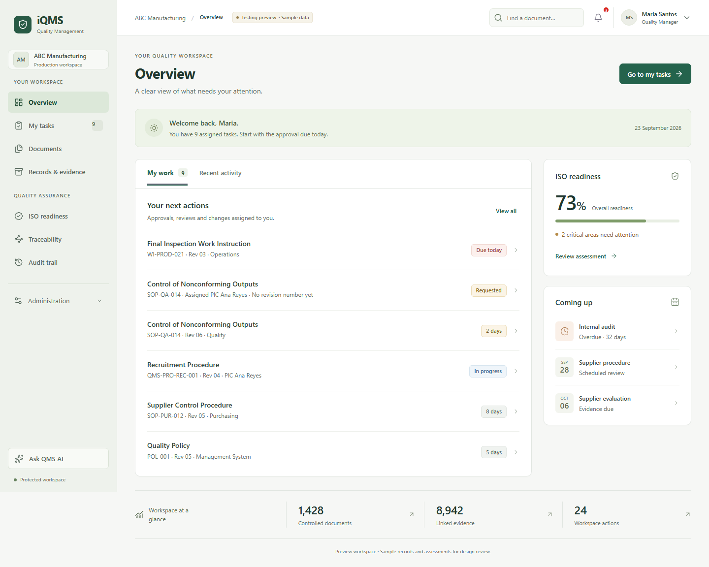

# iQMS — UI testing preview

This branch explores a calmer quality-management workspace. It is a static prototype with sample records, existing demo workflows, and browser-local state.

## Review the design

- **Overview:** the action queue comes first, with one readiness summary and a short deadlines list.
- **Navigation:** persistent labels, four everyday destinations, and a collapsible Administration group.
- **Documents:** searchable register by default; browsing by QMS area remains available.
- **Records:** consistent type sizes, spacing, and status colors.
- **Mobile:** a keyboard-accessible navigation drawer, stacked content, and record lists that fit the screen.
- **Interactions:** document search (`Ctrl/Cmd + K`), combined filters with a clear empty state, deep links, browser Back, and dialog focus management.



[Mobile screenshot](docs/overview-mobile.png) · [Review and validation notes](docs/UI_REVIEW.md)

## Run locally

```sh
npm ci
npm start
```

Open <http://localhost:4173>. No application build or backend is required. The local server binds to this machine only.

## Verify

```sh
npx playwright install chromium
npm test
```

The tests cover interactions, 12 views at seven widths, and automated accessibility at desktop and mobile sizes. For an existing Chromium installation, set `QMS_CHROMIUM` to its executable path.

With the server running, `npm run audit` writes desktop and mobile Lighthouse reports to `artifacts/lighthouse/`. `npm run build:icons` regenerates the small local Lucide bundle from the icons referenced by the app.

## Isolation and scope

The testing branch does not change main or the GitHub Pages publishing configuration. Its browser storage keys start with `iqms-testing.` and do not read or overwrite the main prototype's settings. The preview is marked as sample data and is excluded from search indexing.

The original prototype's backend limitations still apply: demonstration approvals, exports, access controls, document downloads, and AI assessments are not connected to production services. This branch is for reviewing usability and appearance.
